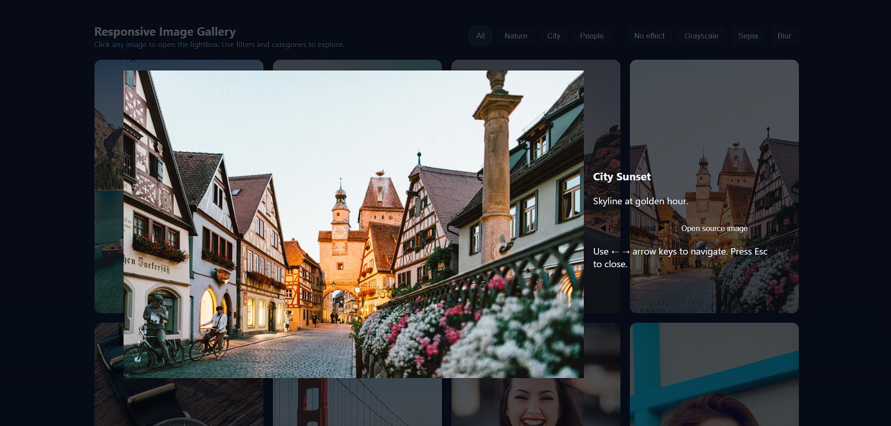
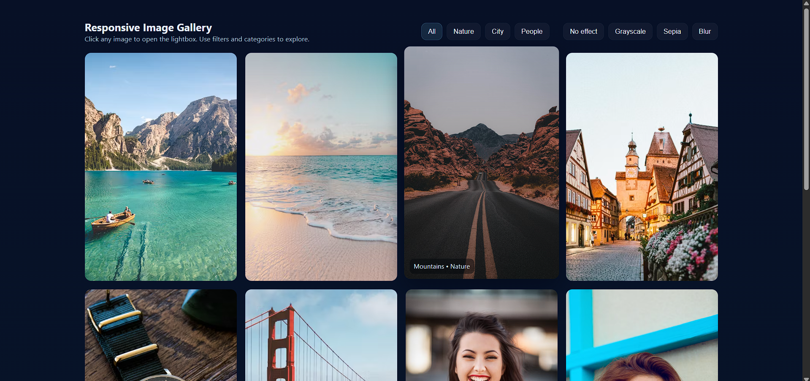

# 🖼️ Image Gallery

A simple responsive **Image Gallery** built using **HTML, CSS, and JavaScript**.  
This project allows users to view images in a clean grid layout with interactive features.

## 🚀 Features
- Responsive design (works on desktop & mobile)
- Image hover effects
- Lightbox / popup view with navigation (next/prev)
- Smooth transitions using CSS
- Easy to customize with your own images

## 📂 Project Structure
imagegallary/
│── index.html # Main HTML file
│── style.css # Styling (layout, transitions, responsiveness)
│── script.js # JavaScript for gallery navigation

bash
Copy code

## ⚡ How to Run
1. Download or clone the repo:
   ```bash
   git clone https://github.com/Vijayshah099/imagegallary.git

 📷 Preview
 

 
